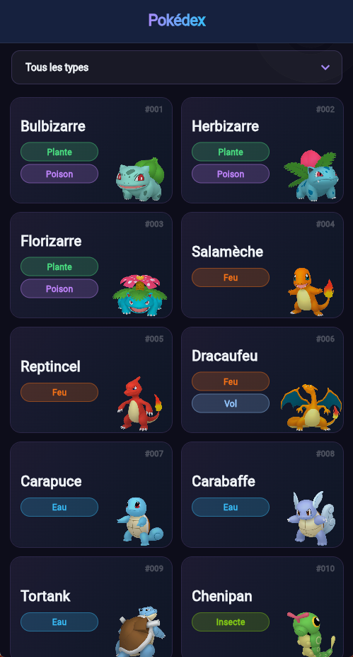
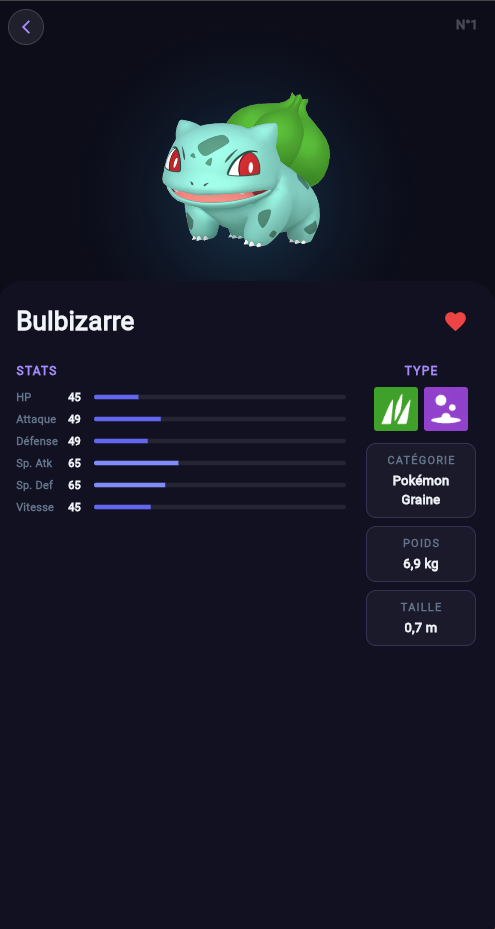

# 📱 Pokédex App — pokemon_client

Application mobile Flutter connectée à une API REST Node.js/MongoDB, permettant de consulter, filtrer et mettre en favoris des Pokémon. Interface Dark Glass sur fond sombre avec accents violet/bleu.

---

## Aperçu

| Liste                                                           | Détail                                                       |
| --------------------------------------------------------------- | ------------------------------------------------------------ |
|  |  |

---

## Fonctionnalités

- **Liste des Pokémon** avec chargement paginé (infinite scroll)
- **Filtre par type** via dropdown (Eau, Feu, Plante, etc.)
- **Fiche détail** avec stats, type, catégorie, poids et taille
- **Système de favoris** avec animation de cœur
- **Support Web & Mobile** avec données réelles (API) ou données locales simulées (fake repository)
- **Design Dark Glass** — palette sombre avec accents dégradé violet → bleu

---

## Stack technique

| Couche           | Technologie                        |
| ---------------- | ---------------------------------- |
| Mobile / Web     | Flutter (Dart)                     |
| State management | Riverpod (`AsyncNotifierProvider`) |
| Navigation       | GoRouter                           |
| Backend          | Node.js + Express                  |
| Base de données  | MongoDB                            |
| HTTP client      | `package:http`                     |

---

## Architecture

```
lib/
└── src/
    ├── common_widgets/
    │   └── styled_type.dart
    ├── features/
    │   └── pokemon/
    │       ├── data/
    │       │   ├── local/
    │       │   │   └── fake_pokemon_repository.dart
    │       │   └── remote/
    │       │       └── pokemon_repository.dart
    │       ├── domain/
    │       │   └── pokemon.dart
    │       └── presentation/
    │           ├── pokemon_list/
    │           │   ├── pokemon_list_screen.dart
    │           │   └── pokemon_card.dart
    │           └── pokemon_details/
    │               ├── pokemon_details_screen.dart
    │               └── heart.dart
    ├── routes/
    │   └── app_router.dart
    └── theme/
        └── app_theme.dart
```

---

## Écrans

### Liste des Pokémon

- Grille 2 colonnes avec `GridView.builder`
- Chaque carte affiche le nom, le ou les types, le numéro et le sprite officiel
- **Infinite scroll** : chargement automatique de la page suivante à 300px du bas
- **Dropdown de filtre** par type — sélectionner "Tous les types" recharge tous les Pokémon


### Fiche détail

- Image officielle en hero avec effet de glow radial
- Barre de stats animée (`LinearProgressIndicator`) avec couleur variable selon la valeur
- Bouton retour glassmorphism
- Bouton favori avec animation de pulse (scale 25→36→25px)
- Paneau latéral : type (icône), catégorie, poids, taille
- Compatible Web (appel API) et Mobile (fake repository)


---

## Thème Dark Glass

Toutes les couleurs sont centralisées dans `app_theme.dart` :

| Token          | Valeur       | Usage             |
| -------------- | ------------ | ----------------- |
| `pageBg`       | `#0D0D1A`    | Fond global       |
| `headerBg`     | `#16213E`    | Header            |
| `accentPurple` | `#A78BFA`    | Accent principal  |
| `accentBlue`   | `#38BDF8`    | Accent secondaire |
| `cardBg`       | `#FFFFFF 5%` | Fond des cartes   |
| `textPrimary`  | `#F1F5F9`    | Texte principal   |
| `textMuted`    | `#64748B`    | Texte secondaire  |

Les badges de type ont chacun leur propre couleur (18 types supportés).

---

## API Backend

Base URL : `http://localhost:3000`

| Méthode | Endpoint                         | Description     |
| ------- | -------------------------------- | --------------- |
| `GET`   | `/pokemons?page=N`               | Liste paginée   |
| `GET`   | `/pokemons/type?type=Eau&page=N` | Filtre par type |
| `GET`   | `/pokemons/:id`                  | Pokémon par ID  |
| `PATCH` | `/pokemons/:id`                  | Toggle favori   |

La pagination retourne `{ pokemons, currentPage, totalPages }`.

---

## Lancer le projet

### Prérequis

- Flutter SDK ≥ 3.x
- Dart ≥ 3.x
- Node.js + MongoDB (pour le backend)

### Installation

```bash
git clone https://github.com/SimonLauper/pokemon_client.git
cd pokemon_client

flutter pub get

flutter run

flutter run -d chrome
```

### Backend

```bash
git clone https://github.com/SimonLauper/pokemon_serveur.git
npm install
npm start
# API disponible sur http://localhost:3000
```

> Sur mobile, l'application utilise automatiquement le `FakePokemonRepository` (données locales) si `kIsWeb` est `false`. Pour tester avec l'API réelle, lancer sur Chrome.

---

## Dépendances Flutter

```yaml
dependencies:
  flutter_riverpod: ^3.3.2
  go_router: ^17.3.0
  http: ^1.6.0
```

---

## Auteur

**Simon Lauper** — Étudiant en développement d'applications @ CEFF, Berne (CH)

[lauper-dev.ch](https://lauper-dev.ch)
